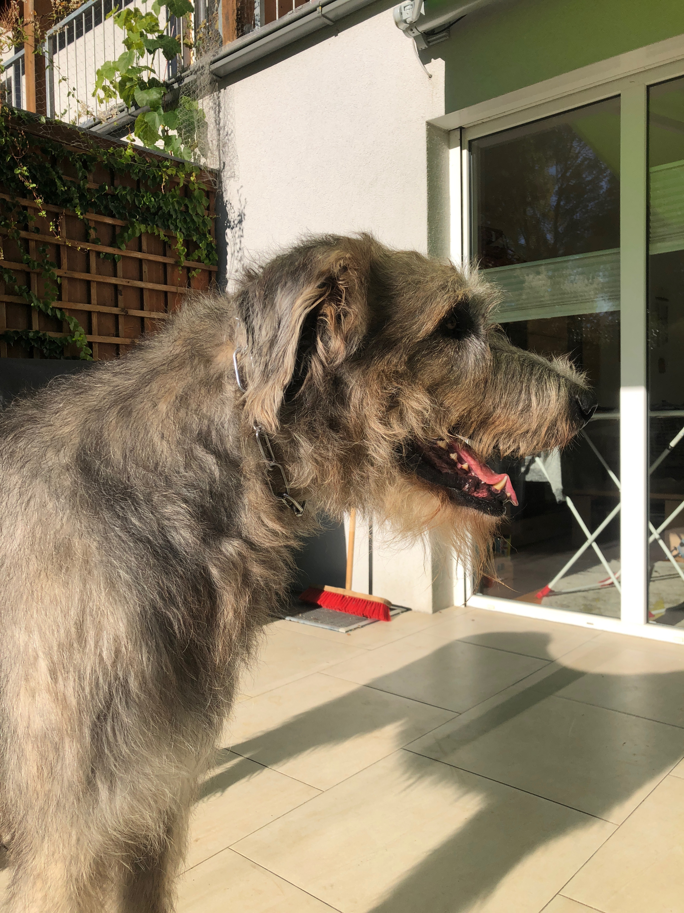

# Wolf vs. Wolfhound

Do not be alarmed. You will not see any bloody scenes in this repository. This is just an attempt to train an AI to recognize the difference between a dog and a wolf. This is a banal task but in the course of a study project we were interested in how well such an AI can distinguish wolfhounds from wolves because they are very simiular to each other. For this I may introduce my own "little" wolfhound Odini:

As a data set to train our AI we use the data set [Dog vs. Wolf](https://www.kaggle.com/harishvutukuri/dogs-vs-wolves) from Kaggle linked here. Based on this we train this two class model with the help of Tensor Flow. The result can be read in the Jupiter Notebook.
